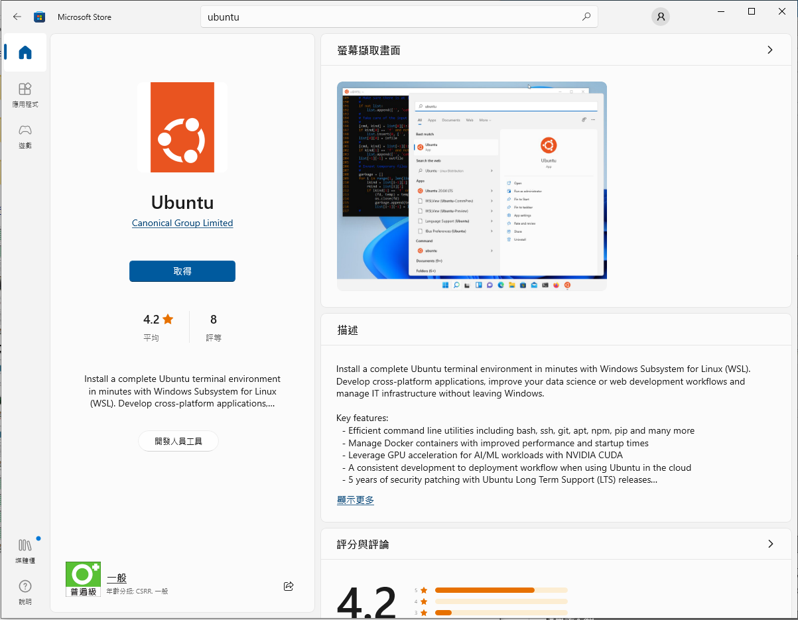

# Rafael Matter setup for Windows (WSL2 , Docker and JLink debugger)

## Pre-request

* Make sure your **System Disk (C:/) has 30GB of space** to set up the environment. (include Matter source code)
* Visual Studio Code: [Download](https://code.visualstudio.com/Download)
* Download Ubuntu from Microsoft Store\


<figure><figcaption><p>Ubuntu</p></figcaption></figure>

## Check Windows pre-request


**NOTE: '$' means this command run on a Linux terminal, others run on PowerShell**


### Check WSL installed:

*   Check WSL in your windows, open PowerShell run:

    <pre class="language-powershell" data-title="PowerShell"><code class="lang-powershell"><strong>wsl
    </strong></code></pre>
* **If you get the command not found message**, you need to activate WSL in Windows. Please follow Microsoft install WSL document: [https://learn.microsoft.com/zh-tw/windows/wsl/install-manual](https://learn.microsoft.com/zh-tw/windows/wsl/install-manual)

### Setting Windows environment:

*   Make sure the WSL's version is version 2, so we update WSL: (This command run with administrator PowerShell)

    
    ```
    wsl --install
    ```
    
*   Set default WSL to WSL2 (This command run with administrator PowerShell)

    
    ```
    wsl --set-default-version 2
    ```
    
*   Launch Ubuntu on WSL (This command run with administrator PowerShell)

    
    ```
    wsl --install -d Ubuntu
    ```
    

### **Here you need to reopen your PowerShell**

*   Check WSL version:

    
    ```
    wsl --list --verbose
    NAME      STATE           VERSION
    * Ubuntu    Running         1
    ```
    
*   **If your "VERSION" is still in version 1**, set it to version 2: Setting Ubuntu's WSL version to WSL2

    
    ```
    wsl --set-version Ubuntu 2
    ```
    
*   Check WSL version again:

    
    ```
    wsl --list --verbose
    NAME      STATE           VERSION
    * Ubuntu    Stopped         2
    ```
    

***

***

