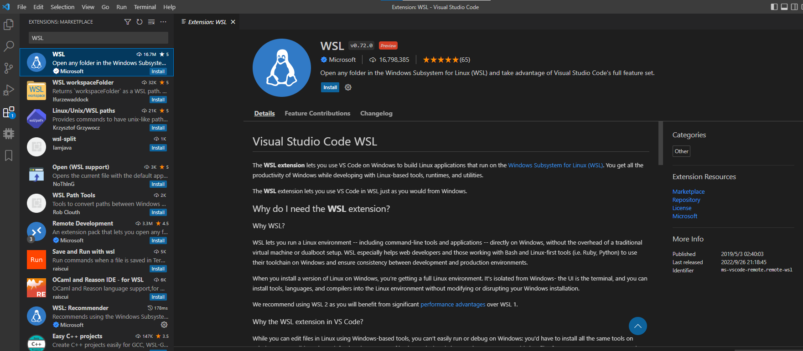
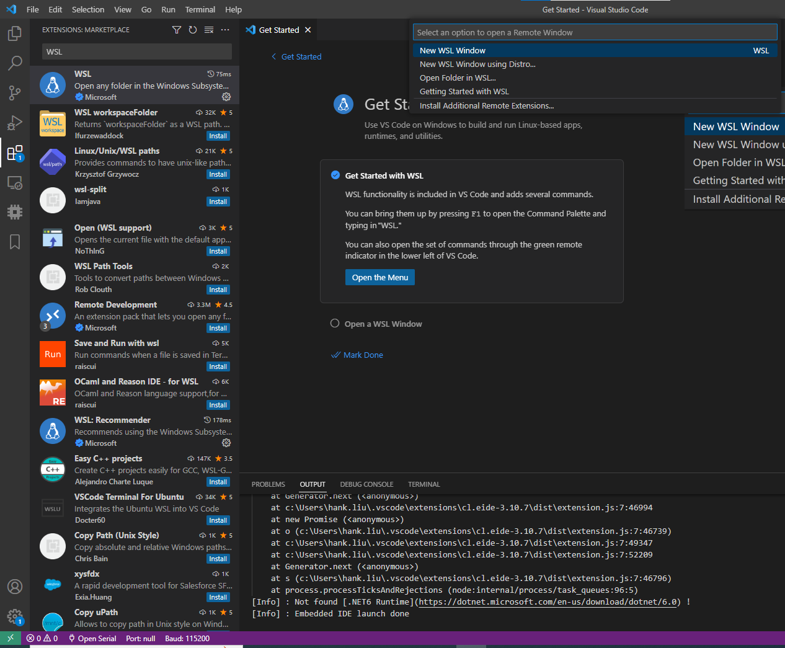

# Activate WSL2

### Activate WSL2

* open VScode and install some extensions for developing environment
  * WSL (ms-vscode-remote.remote-wsl)&#x20;

<figure><figcaption>
install_WSL
</figcaption></figure>

*   Using the lower left icon (like this ><) and select the new WSL window

    * Now the vscode terminal will be a Linux terminal (like this sw@DESKTOP-JNHERQ8:\~$)&#x20;

    <figure><figcaption>
lanch_WSL
</figcaption></figure>
