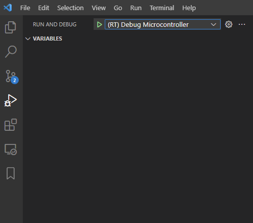

# Debugger setup

### Pre-request

* SEGGER JLink: [Download](https://www.segger.com/downloads/jlink/)

### Setup Network connection between windows and WSL2

* Windows should accept WSL to access the host network, so we need to set up the FireWall setting with "PowerShell administrator"


```
$ New-NetFirewallRule -DisplayName "WSL" -Direction Inbound -InterfaceAlias "vEthernet (WSL)" -Action Allow
```


*   WSL we need setup a host IP's environment variable for VScode to debug scripts

    * \~/.bashrc add the following setting:

    
    ```
    $ sudo <your_text_editor> ~/.bashrc
    $ export WSL_HOST_IP=$(cat /etc/resolv.conf | sed -rn 's|nameserver (.*)|\1|p')
    ```
    

    * Apply those setting:

    
    ```
    $ source ~/.bashrc
    ```
    

    * Install some packages for the debugger

    
    ```
    $ sudo apt-get update
    $ sudo apt-get install libncurses5
    ```
    


Close all Vscode window, and reopen it (This action will help VScode apply the WSL's environment values)


### Setup Configure

* Add Rafael's configure file to JLink:
  * Append JLinkDevices.xml and RT58x\_1MB.FLM to JLink path (ex:C:\Program Files (x86)\SEGGER\JLink)
* Config VSCode debugger setup (task.json):
  * From Task launchJLink "label": "launchJLink"
    * JLink setup : replace command \<JLinkGDBServerCL.exe path>, ex: /mnt/c/Program Files (x86)/SEGGER/JLink/JLinkGDBServerCL.exe ( in WSL C:/ should change to /mnt/c/)


Note: This debugger's Arm Toolchain and execute file will use matter code and decker env, so you need setup matter env before the debugger


<figure><figcaption></figcaption></figure>

***

### Start Debugger
