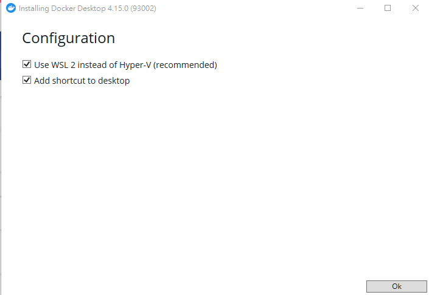

# Install Docker

### Install Docker

#### Windows for docker has two ways to install:&#x20;

1. #### Windows Docker Desktop (recommended)
2. #### Linux original docker (WSL needs setting)



* Docker Desktop: [Download](https://desktop.docker.com/win/main/amd64/Docker%20Desktop%20Installer.exe?utm\_source=docker\&utm\_medium=webreferral\&utm\_campaign=dd-smartbutton\&utm\_location=module)
* You can follow the default installation: (Use WSL2 ... is an important setting)&#x20;

<figure><figcaption></figcaption></figure>

* If you get this message, it means the installer account and the launcher account are different. Please set your windows user group, following the [URL](https://icij.gitbook.io/datashare/faq-errors/you-are-not-allowed-to-use-docker-you-must-be-in-the-docker-users-group-.-what-should-i-do)

```
'You are not allowed to use Docker, you must be in the "docker-users" group'.
```

*   If you get a Docker permission error, run this command in WSL:

    
    ```
    $ sudo usermod -aG docker $USER
    ```
    



*   **Setup WSL2 docker:**

    *   Add some settings in /etc/docker/daemon.json

        
        ```
        $ sudo mkdir /etc/docker/
        $ sudo <your_text_editor> /etc/docker/daemon.json
        {
            "hosts": ["unix:///mnt/wsl/shared-docker/docker.sock"]
        }
        ```
        
    *   Add some setting in \~/.bashrc:

        
        ```
        $ sudo <your_text_editor> ~/.bashrc

        DOCKER_DISTRO="Ubuntu"
        DOCKER_DIR=/mnt/wsl/shared-docker
        DOCKER_SOCK="$DOCKER_DIR/docker.sock"
        export DOCKER_HOST="unix://$DOCKER_SOCK"
        if [ ! -S "$DOCKER_SOCK" ]; then
            mkdir -pm o=,ug=rwx "$DOCKER_DIR"
            sudo chgrp docker "$DOCKER_DIR"
            /mnt/c/Windows/System32/wsl.exe -d $DOCKER_DISTRO sh -c "nohup sudo -b dockerd < /dev/null > $DOCKER_DIR/dockerd.log 2>&1"
        fi
        DOCKER_SOCK="/mnt/wsl/shared-docker/docker.sock"
        ```
        
    *   Apply above setting

        
        ```
        $ source ~/.bashrc
        $ sudo service docker start
        ```
        
    *   Install your docker in WSL

        
        ```
        $ curl -fsSL https://get.docker.com -o get-docker.sh
        $ sudo sh get-docker.sh
        $ sudo usermod -aG docker $USER
        ```
        
    *   During `$sudo sh get-docker.sh`, you will get the following information, which is normal in WSL2:

        
        ```
        ================================================================================
        To run Docker as a non-privileged user, consider setting up the
        Docker daemon in rootless mode for your user:
            dockerd-rootless-setuptool.sh install
        Visit https://docs.docker.com/go/rootless/ to learn about rootless mode.
        To run the Docker daemon as a fully privileged service, but granting non-root
        users access, refer to https://docs.docker.com/go/daemon-access/
        WARNING: Access to the remote API on a privileged Docker daemon is equivalent
                to root access on the host. Refer to the 'Docker daemon attack surface'
                documentation for details: https://docs.docker.com/go/attack-surface/
        ================================================================================
        ```
        

    **Here you need to close VScode and WSL shell and reopen it**

    *   Test docker working or not

        ```
        $ docker run hello-world
        ```


